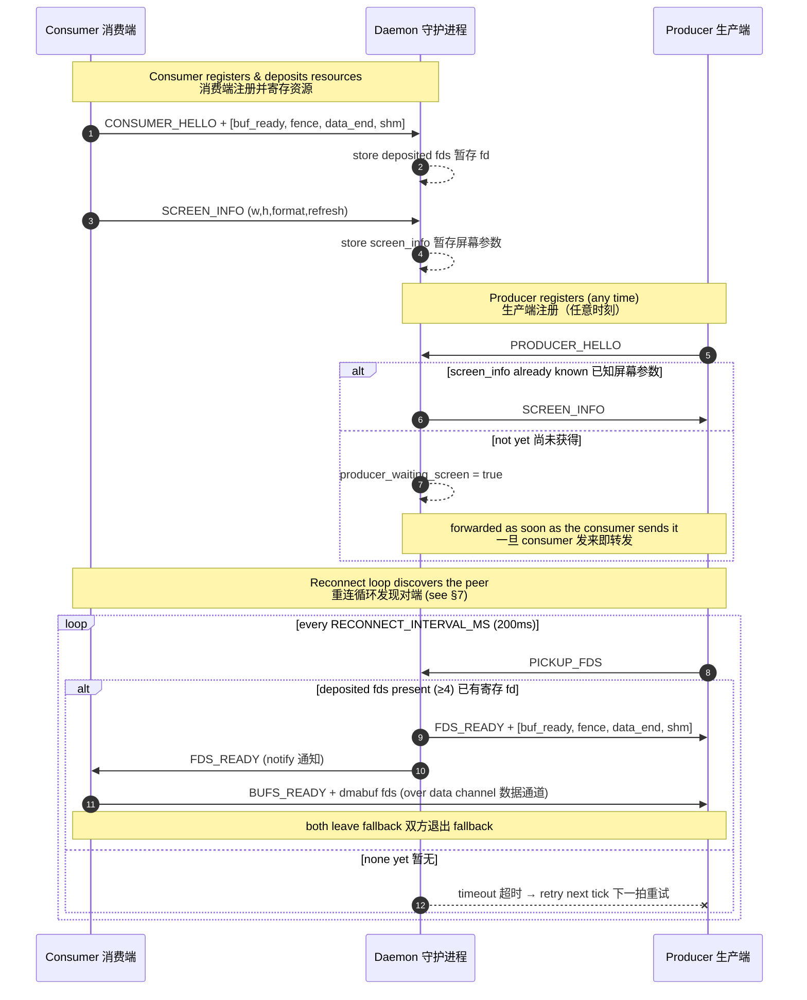
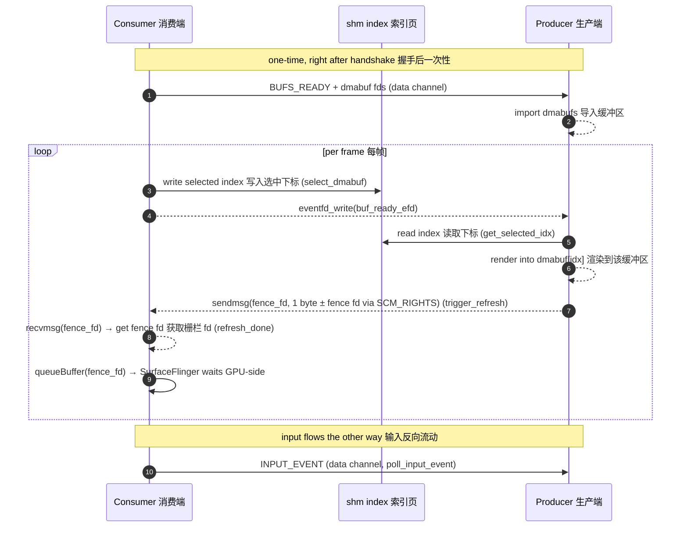
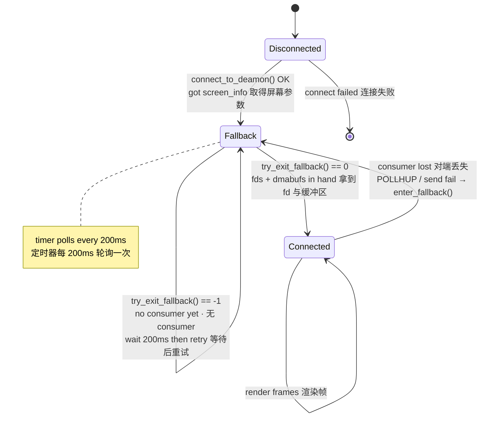
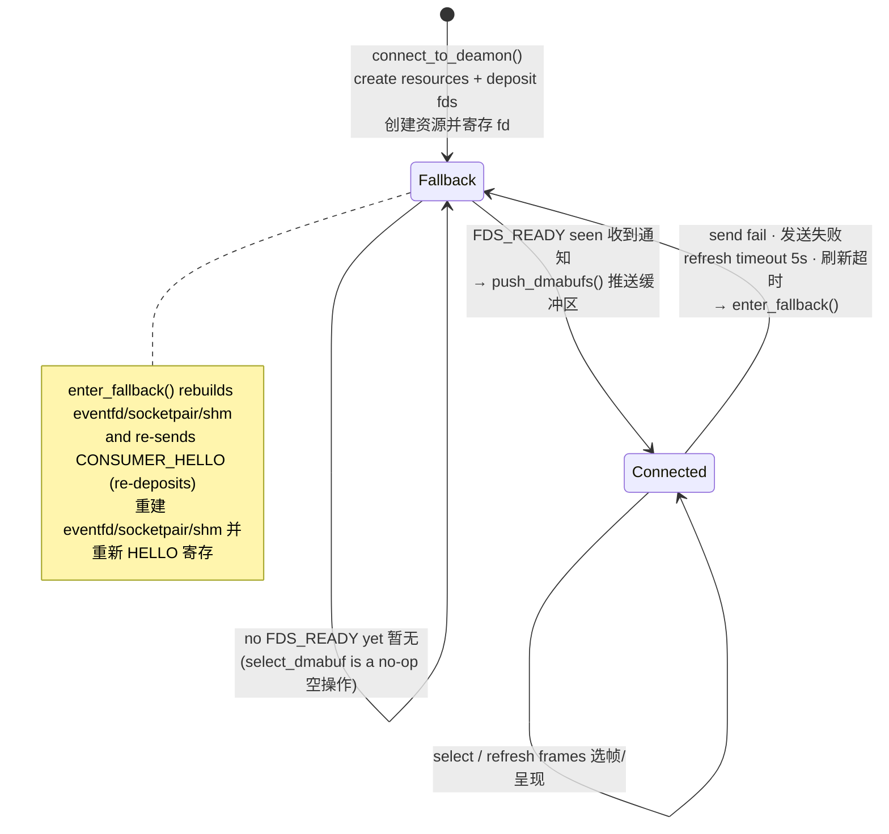

# Anland Display Protocol V2 — Anland 显示协议 V2

> A buffer‑sharing protocol that lets a Linux compositor (KWin / Weston) render its
> desktop into GPU buffers that an Android surface presents, brokered by a small
> daemon over a Unix domain socket.
>
> **V2** introduces a dedicated render‑done **fence channel** that carries a real
> dma‑buf sync‑file fence from the producer to the consumer (via `SCM_RIGHTS` over
> a `socketpair`), replacing the V1 eventfd‑only notification. This lets the consumer
> hand the fence to `ANativeWindow_queueBuffer()` / `SurfaceFlinger` — which waits
> on it **GPU‑side** — so the producer never needs a `glFinish()` or similar
> CPU‑blocking synchronization.
>
> 一套缓冲区共享协议：Linux 合成器（KWin / Weston）把桌面渲染进 GPU 缓冲区，
> 由 Android 端的显示表面进行呈现，二者通过一个轻量守护进程在 Unix 域套接字上完成对接。
>
> **V2** 新增了一条专用的渲染完成**栅栏通道**，producer 通过 `SCM_RIGHTS` 在
> `socketpair` 上将真实的 dma-buf sync‑file fence 传递给 consumer，取代 V1 仅
> eventfd 的通知方式。这使得 consumer 可以将 fence 交给
> `ANativeWindow_queueBuffer()` / `SurfaceFlinger` 进行 GPU 端等待，producer
> 无需 `glFinish()` 之类的 CPU 阻塞同步。

---

## 1. Roles · 角色

| Role 角色 | Binary 程序 | Responsibility 职责 |
|-----------|-------------|---------------------|
| **Daemon** 守护进程 | `daemon` | Rendezvous broker. Holds **at most one** consumer and **one** producer, stores the screen info, and passes file descriptors between them with `SCM_RIGHTS`. **Unchanged from V1.** 充当对接中介，最多保存一个 consumer 与一个 producer，缓存屏幕信息，并通过 `SCM_RIGHTS` 在两者间传递文件描述符。**与 V1 相同，无需更新。** |
| **Consumer** 消费端 | Android app / `test_sdl_consumer` | **Owns the resources.** Allocates the dmabufs, the buffer‑ready eventfd, the shm index page, and **two** socketpairs (`data` + `fence`), and *presents* the rendered frames. 拥有全部资源：分配 dmabuf、buffer‑ready eventfd、shm 索引页与**两条** socketpair（`data` + `fence`），并最终**呈现**已渲染的帧。 |
| **Producer** 生产端 | KWin / Weston `backend-anland` | The compositor. *Renders* desktop content into the consumer's shared buffers. 即合成器，把桌面内容**渲染**进 consumer 提供的共享缓冲区。 |

> [!NOTE]
> **Naming 命名**: the *producer* produces pixel content; the *consumer* consumes
> (displays) it. The consumer is the resource owner because it is the side that
> physically scans the buffers out to the panel.
> “producer” 生产像素内容，“consumer” 消费（显示）这些内容。consumer 是资源拥有者，
> 因为它才是把缓冲区真正扫描输出到屏幕的一方。

---

## 2. Transport & Channels · 传输与通道

There are **four** communication paths — but the fence channel now uses a
**socketpair** instead of an eventfd.

共有**四条**通信路径——但 fence 通道现在使用 **socketpair** 替代 eventfd。

| Channel 通道 | Kind 类型 | Created by 创建者 | Carries 承载内容 |
|--------------|-----------|-------------------|------------------|
| **Control** 控制通道 | `AF_UNIX` `SOCK_STREAM` to daemon | each peer 各端各一条 | `ctrl_msg` handshake messages 握手控制消息 |
| **Data** 数据通道 | `socketpair()` | Consumer | `data_msg`: dmabuf set + input events 缓冲区集合与输入事件 |
| **buf_ready** | `eventfd` | Consumer | Consumer → Producer: "a buffer is selected, render it" 已选定缓冲区，请渲染 |
| **fence** (V2 新增) | `socketpair()` | Consumer | Producer → Consumer: render‑done message + optional `SCM_RIGHTS` fence fd 渲染完成消息 + 可选栅栏 fd |
| **shm index** 索引页 | 4‑byte `memfd` | Consumer | selected buffer index 当前选中的缓冲区下标 |

Default daemon socket path · 守护进程默认套接字路径:
`/data/local/tmp/display_daemon.sock`

All control/data framing uses a fixed 8‑byte header followed by an optional payload
(`common/protocol.h`):

所有控制/数据帧都是固定 8 字节头部加可选负载（见 `common/protocol.h`）：

```c
struct ctrl_msg { uint32_t type; uint32_t size; uint8_t payload[]; } __attribute__((packed));
struct data_msg { uint32_t type; uint32_t size; uint8_t payload[]; } __attribute__((packed));
```

`size` is the payload length in bytes (header excluded). Reliable framing helpers
`send_all` / `recv_all` and the ancillary‑fd helpers `send_fds` / `recv_fds` live in
`common/socket_utils.c`.

`size` 为负载字节数（不含头部）。可靠收发函数 `send_all` / `recv_all` 及附带 fd 的
`send_fds` / `recv_fds` 见 `common/socket_utils.c`。

---

## 3. The four deposited descriptors · 寄存的四个描述符

When the consumer says hello it attaches **four** fds (via `SCM_RIGHTS`), in this exact
order — see `send_hello_fds()` in `display_consumer.c`:

consumer 打招呼时通过 `SCM_RIGHTS` 附带**四个** fd，顺序固定如下
（见 `display_consumer.c` 的 `send_hello_fds()`）：

| Index 下标 | V1 | V2 | Direction 方向 | Purpose 用途 |
|:---------:|----|----|----------------|--------------|
| `fds[0]` | `buf_ready_efd` | `buf_ready_efd` (不变) | C → P | consumer signals a selected buffer 选定缓冲区的信号 |
| `fds[1]` | `refresh_done_efd` (eventfd) | **`fence_fd` socketpair 写端** | P → C | render‑done message + optional fence fd via `SCM_RIGHTS` 渲染完成消息 + 可选栅栏 fd |
| `fds[2]` | data‑channel end | data‑channel end (不变) | C ↔ P | the producer's end of the socketpair socketpair 的 producer 端 |
| `fds[3]` | `shm_fd` | `shm_fd` (不变) | C → P | the 4‑byte selected‑index page 4 字节索引页 |

> **V2 变更**：`fds[1]` 从 `eventfd` 变更为 `socketpair` 写端，用于传递渲染完成与栅栏 fd

The consumer keeps `sv[0]` as its own `data_fd` and deposits `sv[1]`. The daemon stores
these as **deposited fds** and hands them to the producer on request. **The daemon is
opaque to the fd semantics — no daemon update needed.**

consumer 自留 `sv[0]` 作为自身 `data_fd`，寄存 `sv[1]`。守护进程把这些保存为
**deposited fds**，待 producer 请求时转交。**Daemon 不感知 fd 语义，无需更新。**

---

## 4. Message reference · 消息参考

### 4.1 Control messages (control channel) · 控制消息（控制通道）

| Message 消息 | Value | Direction 方向 | Payload / FDs 负载/描述符 | Meaning 含义 |
|--------------|:-----:|----------------|---------------------------|--------------|
| `CTRL_MSG_CONSUMER_HELLO` | 1 | C → D | + 4 fds | register as consumer & deposit fds 注册为 consumer 并寄存 fd |
| `CTRL_MSG_PRODUCER_HELLO` | 2 | P → D | — | register as producer 注册为 producer |
| `CTRL_MSG_SCREEN_INFO`    | 7 | C → D, D → P | `screen_info` | publish / forward screen geometry 发布/转发屏幕参数 |
| `CTRL_MSG_REJECT`         | 8 | D → C | — | screen‑info mismatch, connection refused 屏幕参数冲突，拒绝 |
| `CTRL_MSG_PICKUP_FDS`     | 9 | P → D | — | producer asks for the deposited fds producer 索取寄存的 fd |
| `CTRL_MSG_FDS_READY`      | 10 | D → P (+4 fds), D → C (notify) | + 4 fds to producer | fds handed over 描述符已交付 |

### 4.2 Data messages (data channel) · 数据消息（数据通道）

| Message 消息 | Value | Direction 方向 | Payload / FDs 负载/描述符 | Meaning 含义 |
|--------------|:-----:|----------------|---------------------------|--------------|
| `DATA_MSG_BUFS_READY` | 200 | C → P | `N × buf_info` + `N` dmabuf fds | the shared dmabuf set 共享缓冲区集合 |
| `DATA_MSG_INPUT_EVENT`| 102 | C → P | `InputEvent` | touch / key / pointer event 触摸/按键/指针事件 |
| `DATA_MSG_BUF_READY`  | 100 | — | *reserved* 保留 | superseded by `buf_ready_efd` 由 eventfd 取代 |
| `DATA_MSG_REFRESH_DONE`| 101 | — | *reserved* 保留 | superseded by **fence channel** 由 fence 通道取代 |

### 4.3 Structures · 结构体

```c
struct screen_info { uint32_t width, height, format, refresh; };          // 屏幕参数
struct buf_info    { uint32_t stride, format; uint64_t modifier; uint32_t offset; }; // 单个 dmabuf 描述
// struct InputEvent: tagged union over touch / key / pointer_{motion,button,axis}
```

> [!IMPORTANT]
> Per‑frame buffer hand‑off does **not** use data messages. The selected index travels
> through the `shm` page, `buf_ready_efd` (select) and the **fence channel**
> (render‑done + optional fence). — see §6.
> 逐帧的缓冲区交接**不**走数据消息。选中下标通过 `shm` 页、`buf_ready_efd`（选中）与
> **fence 通道**（渲染完成 + 可选栅栏）传递，详见 §6。

---

## 5. Handshake flow · 握手流程

The daemon **decouples ordering**: consumer and producer may connect in either order.
Whoever arrives first is parked until the other appears. **The handshake wire protocol
is unchanged from V1.**

守护进程**解耦了连接顺序**：consumer 与 producer 可以任意先后连接。先到者会被暂存，
直到另一端出现。**握手线上协议与 V1 相同。**



### Screen‑info lock · 屏幕参数锁

The daemon stores the **first** `screen_info` it sees. A later consumer presenting a
*different* geometry is sent `CTRL_MSG_REJECT` and dropped — the session is locked to a
single display mode (`daemon.c`, `handle_client_data`).

守护进程保存**第一份** `screen_info`。之后若有 consumer 提交**不同**的几何参数，会收到
`CTRL_MSG_REJECT` 并被断开——会话被锁定为单一显示模式（见 `daemon.c` 的
`handle_client_data`）。

---

## 6. Steady‑state frame loop · 稳态帧循环 (V2 关键变更)

Once both sides have left fallback, every frame is exchanged **without touching the
daemon** — over the shared `shm` page, `buf_ready_efd` and the **dedicated fence
channel** (`socketpair`).

双方退出 fallback 后，每一帧的交换都**不再经过守护进程**——通过共享 `shm` 页、
`buf_ready_efd` 与**专用 fence 通道**（socketpair）完成。



- `select_dmabuf(idx)` → writes `idx` to shm, signals `buf_ready_efd`. 写入下标并触发信号。
- producer wakes on `buf_ready_efd`, reads idx from shm, renders, may call
  `set_render_fence(fence_fd)` to stash a render-done fence, then calls
  `trigger_refresh()`. 被唤醒后读下标、渲染、可选存 fence、再调用 `trigger_refresh()`。
- `trigger_refresh()` sends 1 byte (+ optionally fence fd via `SCM_RIGHTS`)
  on the fence socketpair. 在 fence socketpair 上发送 1 字节 + 可选 SCM_RIGHTS fence fd。
- `refresh_done()` waits on fence channel with a **5 s** timeout, reads the message,
  returns the fence fd (or `-1` if none). 在 fence 通道上等待，**5 秒**超时即进入 fallback，
  读取消息后返回 fence fd（或 `-1` 无 fence）。

---

## 7. State machine · 状态机

Both peers boot **in `fallback`** and *discover each other only by repeatedly attempting
the handshake through the daemon*. There is no direct peer connection and no "peer is
online" notification — discovery **is** a successful reconnect attempt. **The state
machine is unchanged from V1.**

两端都以 **`fallback`** 状态启动，且**只能通过守护进程反复尝试握手来发现彼此**。两端之间
没有直接连接，也没有"对端在线"的通知——发现对端**就等于**一次成功的重连尝试。
**状态机与 V1 相同。**

### 7.1 Producer state machine · 生产端状态机

`connect_to_deamon()` performs **only** the daemon handshake (it fetches `screen_info`)
and deliberately leaves the context in fallback. The backend then runs a timer
(`RECONNECT_INTERVAL_MS = 200 ms`) that polls `try_exit_fallback()`.

`connect_to_deamon()` **只**完成守护进程握手（取得 `screen_info`），随后刻意停留在
fallback。backend 再以定时器（`RECONNECT_INTERVAL_MS = 200 ms`）轮询 `try_exit_fallback()`。



`try_exit_fallback()` is **two‑step and atomic** — fallback clears only when *both*
succeed (`display_producer.c`):

`try_exit_fallback()` 是**两步且原子**的——只有两步**都**成功才会清除 fallback
（见 `display_producer.c`）：

1. **`pickup_fds()`** — send `PICKUP_FDS`, poll `ctrl_fd` (100 ms) for `FDS_READY`,
   receive **4** fds (the V2 set: `{buf_ready_efd, fence_fd, data_fd, shm_fd}`),
   `mmap` the shm. 发送 `PICKUP_FDS`，轮询 100 ms 等 `FDS_READY`，
   收下 V2 的 **4** 个 fd 并 `mmap` 索引页。
2. **`receive_dmabufs()`** — poll `data_fd` (100 ms) for `BUFS_READY`, store the dmabuf
   set. 轮询 100 ms 等 `BUFS_READY`，保存缓冲区集合。

Any failure → `release_consumer_resources()` and stay in fallback, safe to retry next
tick. On success the backend wires up the fd event sources and imports the dmabufs
(`anland_consumer_connected()`).

任一步失败即 `release_consumer_resources()` 并留在 fallback，可在下一拍安全重试。成功后
backend 注册 fd 事件源并导入缓冲区（`anland_consumer_connected()`）。

### 7.2 Consumer state machine · 消费端状态机

The consumer creates its resources and deposits them at `connect_to_deamon()`, starting
in fallback. It leaves fallback **lazily**: each `select_dmabuf()` first calls
`try_exit_fallback()`, which simply checks whether the daemon has forwarded an
`FDS_READY` (i.e. a producer has just picked up the fds).

consumer 在 `connect_to_deamon()` 时创建资源并寄存，初始为 fallback。它**惰性**退出
fallback：每次 `select_dmabuf()` 先调用 `try_exit_fallback()`，仅检查守护进程是否已转发
`FDS_READY`（即刚有 producer 取走了 fd）。



> [!NOTE]
> **Why the producer is the active poller 为何由 producer 主动轮询**: the producer cannot
> tell whether a consumer exists, so it keeps asking the daemon "give me the fds"
> (`PICKUP_FDS`) every 200 ms. The daemon answers `FDS_READY` *only* when it actually
> holds a consumer's deposited fds — so the producer discovers the consumer purely by an
> attempt succeeding. The consumer learns a producer appeared when the daemon forwards
> that same `FDS_READY` to it.
> producer 无法得知 consumer 是否存在，于是每 200 ms 向守护进程索取 fd（`PICKUP_FDS`）。
> 守护进程**仅**在确实持有 consumer 寄存的 fd 时才回 `FDS_READY`——因此 producer 完全靠
> "尝试成功"来发现 consumer；而当守护进程把同一个 `FDS_READY` 转发给 consumer 时，
> consumer 便得知 producer 已出现。

---

## 8. Disconnection & recovery · 断连与恢复

| Event 事件 | Detected by 检测方 | Reaction 反应 |
|------------|--------------------|---------------|
| Producer drops consumer 对端丢失 | `POLLHUP`/`POLLERR` on `data_fd`, or send failure 数据通道挂断或发送失败 | `enter_fallback()`: release consumer resources, fire callback, resume 200 ms reconnect timer. 释放资源、触发回调、恢复重连定时器。 |
| Consumer loses producer 失去对端 | send failure or 5 s `refresh_done` timeout 发送失败或 5 秒刷新超时 | `enter_fallback()`: tear down + rebuild eventfd/socketpair/shm, re‑send `CONSUMER_HELLO` (re‑deposit). 拆除并重建资源，重新 HELLO 寄存。 |
| Consumer reconnects mid‑session 会话中重连 | daemon `CONSUMER_HELLO` with ≥3 fds 守护进程收到带 fd 的 HELLO | replaces deposited fds; if a producer is waiting, delivers immediately. 替换寄存 fd；若 producer 正等待则立即交付。 |
| Either peer reconnects 任一端重连 | new `*_HELLO` 新的 HELLO | the daemon frees the previous client of that role and installs the new one. 守护进程释放该角色的旧连接并接纳新连接。 |

Because re‑entering fallback re‑deposits a fresh resource set, recovery flows back
through the **exact same** reconnect path as first‑time discovery — there is a single
code path for "bring the consumer up", whether it is the first time or the hundredth.

由于重新进入 fallback 会再次寄存一套全新资源，恢复过程会沿着与首次发现**完全相同**的
重连路径回流——无论第一次还是第一百次，"拉起 consumer"都只有一条代码路径。

---

## 9. Design notes · 设计要点

- **Single reconnect path 单一重连路径** — both startup and recovery funnel through
  `try_exit_fallback()`; there is no separate "first connect" logic. 启动与恢复都汇入
  `try_exit_fallback()`，没有单独的"首次连接"逻辑。
- **Atomic exit 原子退出** — the producer leaves fallback only with *both* the fds and the
  dmabufs in hand, so the backend can import and render immediately. producer 必须同时
  拿到 fd 与 dmabuf 才退出 fallback，从而可立即导入并渲染。
- **Daemon is off the hot path 守护进程不在热路径** — it only brokers the handshake; every
  frame afterwards is shm + eventfd + fence channel, zero daemon round‑trips. 守护进程只负责握手，之后
  每帧仅用 shm + eventfd + fence 通道，零守护进程往返。
- **Non‑blocking handshake 非阻塞握手** — handshake polls use a short `100 ms` timeout so
  the producer's reconnect loop stays responsive when no consumer is present. 握手轮询采用
  较短的 `100 ms` 超时，保证无 consumer 时 producer 的重连循环仍然灵敏。
- **Display‑mode lock 显示模式锁** — the first `screen_info` wins; mismatching consumers are
  rejected. 以第一份 `screen_info` 为准，参数不符的 consumer 会被拒绝。
- **GPU‑side fence 同步** — the producer sends a real dma-buf sync-file fence via
  `SCM_RIGHTS`; the consumer hands it to SurfaceFlinger, eliminating CPU‑side
  `glFinish()` stalls. producer 通过 `SCM_RIGHTS` 传递真实的 dma-buf sync-file fence；
  consumer 将其交给 SurfaceFlinger，消除了 CPU 端 `glFinish()` 阻塞。

---

## 10. API Changes from V1 · V1 至 V2 API 变更

### 10.1 Producer library (`libdisplay_producer`) — **源码级向下兼容**

| Function | V1 | V2 | 兼容性 |
|----------|----|----|--------|
| `connect_to_deamon()` | 相同签名 | 相同签名 | ✅ 不变 |
| `disconnect()` | 相同签名 | 相同签名 | ✅ 不变 |
| `get_screen_info()` | 相同签名 | 相同签名 | ✅ 不变 |
| `trigger_refresh()` | `eventfd_write()` 通知 | `sendmsg()` over socketpair + 可选 fence fd (签名不变) | ✅ **源码级兼容**：无 fence 时发送裸 byte，consumer 侧返回 -1 |
| `set_render_fence()` | 不存在 | **新增**：`void set_render_fence(ctx, fence_fd)` | ✅ **新增 API**，不影响旧代码 |
| `get_data_fd()` / `get_buffer_ready_fd()` / `get_buf_count()` / `get_selected_idx()` / `get_dmabuf_fd()` / `get_dmabuf_info()` | 相同签名 | 相同签名 | ✅ 不变 |
| `is_fallback()` / `try_exit_fallback()` / `set_fallback_callback()` / `poll_input_event()` | 相同签名 | 相同签名 | ✅ 不变 |

> **Producer 源码级兼容**：V1 调用者仅调用 `trigger_refresh()` 而不调用 `set_render_fence()`
> 时，v2 库会发送不带 fence 的裸消息，consumer 侧正确返回 -1（"无显式 fence，立即可用"）。
> 新旧 producer 源码无需任何修改即可链接 v2 库。

### 10.2 Consumer library (`libdisplay_consumer`) — **API 与 ABI 均不兼容**

| Function | V1 | V2 | 兼容性 |
|----------|----|----|--------|
| `connect_to_deamon()` | 创建 1 socketpair + 2 eventfds | 创建 **2** socketpairs + 1 eventfd | ❌ **ABI 不兼容**（内部结构变化） |
| `refresh_done()` | 返回 `int` (0 = 成功, -1 = 失败) | 返回 **fence fd** (>=0 = 栅栏 fd, -1 = 无/失败) | ❌ **语义不兼容** |
| `push_dmabufs()` | 有 `count` 边界检查 | 去掉边界检查 | ⚠️ 行为差异 |
| `push_input_event()` / `select_dmabuf()` / `set_screen_info()` / `set_fallback_callback()` / `disconnect()` | 相同签名 | 相同签名 | ✅ 签名不变，但底层实现已变 |

> **Consumer 必须修改代码**，至少需要：
> 1. 将 `refresh_done()` 返回值作为 fence fd 传递给 `queueBuffer()`（而非忽略）
> 2. 库使用的内部 `struct display_ctx` 布局已变，**不可**与 V1 库混用

### 10.3 Daemon — **无需更新**

| 方面 | 说明 |
|------|------|
| fd 中继 | Daemon 通过 `SCM_RIGHTS` 存储/转发 fd，**不感知**单个 fd 的语义 |
| slot 数量 | V1 与 V2 consumer 都寄送 **4** 个 fd，daemon 的 `deposited_fd_count >= 4` 检查不受影响 |
| ctrl_msg 类型 | 所有消息类型不变 |
| **结论** | **daemon 零改动，直接复用二进制** |

---

## 11. Compatibility Summary · 兼容性总结

| 组件 | 库级别 | 是否需要修改 |
|------|--------|-------------|
| **Producer library** (`libdisplay_producer`) | **源码级向下兼容** | **不需要**：V1 代码直接链接 v2 库可正常运行（无 fence 场景），新增 `set_render_fence()` 可选使用 |
| **Producer ABI** (`display_ctx` 结构体) | **不兼容** | 内部布局变更（`refresh_done_efd` → `fence_fd`, 新增 `pending_render_fence`），**不可混用** V1 .o 与 V2 .a |
| **Consumer library** (`libdisplay_consumer`) | **API 与 ABI 均不兼容** | 必须升级：`refresh_done()` 返回值语义改变 |
| **Daemon** | **完全兼容** | **零修改**，直接使用原二进制 |
| **Wire protocol** (fd slot 顺序) | **不兼容** | V1 daemon **不受影响**（不解析语义），但 V1 consumer 二进制无法与 V2 直接互操作（需要重编） |

### What V1 code can do with V2 libraries

| Scenario | Result |
|----------|--------|
| V1 producer `.c` + V2 `libdisplay_producer.so` | ✅ **正常工作** — 仅调用 `trigger_refresh()`，不调 `set_render_fence()`，consumer 收到 -1 fence |
| V1 producer `.o` + V2 `libdisplay_producer.a` | ❌ **链接错误** — `display_ctx` 布局不匹配 |
| V1 consumer `.c` + V2 `libdisplay_consumer.so` | ❌ **需要改写** — `refresh_done()` 返回 fence fd，需传给 `queueBuffer` |
| V1 daemon binary + V2 producer/consumer | ✅ **正常工作** — daemon 不感知 fd 语义 |

---

## 12. Migration Guide · 迁移指南

### 12.1 Producer — **无需同步迁移，直接拷贝库即可**

V1 producer 代码可直接链接 v2 `libdisplay_producer`，行为完全正确：

```c
// V1 producer code — unchanged, works with V2 library
trigger_refresh(ctx);  // V2: sends 1 bare byte on fence channel, no fence
```

**升级步骤：**

1. 拷贝新的 `display_producer.c` / `display_producer.h` / `socket_utils.{c,h}` / `protocol.h` 到你的源码树
2. 如有需要，**可选**使用新增的 `set_render_fence()` 获取 GPU‑side fence 优势：

```c
// V2 optional fence usage (producer)
void doEndFrame(display_ctx *ctx) {
    int fence_fd = create_sync_fence();  // dma-buf sync_file
    set_render_fence(ctx, fence_fd);     // stash fence
    trigger_refresh(ctx);                // send with SCM_RIGHTS
}
```

### 12.2 Consumer — **必须同步迁移，需要修改代码**

Consumer 必须升级因为 `refresh_done()` 的返回值语义变了：

**V1 代码：**
```c
select_dmabuf(ctx, idx);
refresh_done(ctx);               // 返回 0 / -1，忽略返回值
ANativeWindow_unlockAndPost(win); // 或 queueBuffer with -1
```

**V2 代码：**
```c
select_dmabuf(ctx, idx);
int rfence = refresh_done(ctx);  // 返回 fence fd 或 -1
api.queueBuffer(win, anb, rfence);  // SurfaceFlinger 等待 fence
```

**升级步骤：**

1. 使用新的 `display_consumer.{c,h}` 替换旧文件
2. 将 `refresh_done()` 的返回值传递给平台的 buffer 提交函数
3. 重新编译

### 12.3 Daemon — **无需更新**

直接复用 V1 的 daemon 二进制即可。

---

## 13. Source map · 源码索引

| Area 区域 | V1 File | V2 File | 变更 |
|-----------|---------|---------|------|
| Wire format & constants 协议常量 | [common/protocol.h](common/protocol.h) | 同 | 不变 |
| Framing & fd passing 收发与 fd 传递 | [common/socket_utils.c](common/socket_utils.c) | 同 | 不变 |
| Broker 中介 | [daemon/daemon.c](daemon/daemon.c) | 同 | **不变** |
| **Consumer library** 消费端库 | `libdisplay_consumer/display_consumer.c` | 同 (代码已更新) | **V2 重写**：双 socketpair、fence 通道 |
| **Producer library** 生产端库 | `libdisplay_producer/display_producer.c` | 同 (代码已更新) | **V2 源码兼容**：新增 `set_render_fence()` |
| **Android consumer app** (V2) | `consumers/anland/` | `consumers/anland_v2/` | **V2 新 consumer**：使用 fence fd，采用 `dequeueBuffer/queueBuffer` |
| V1 软链接参考消费端 | `consumers/anland/` | 保留 | 指向 V1 库 |
| V2 新软链接参考消费端 | — | `consumers/anland_v2/` | 指向 V2 库 |
| Vendored consumer example 拷贝库的消费端示例 | `consumers/anland_virtual_keyboard/` | `consumers/anland_v2/` (新增) | V2 新 consumer |

---

## 14. License · 许可

This project's own code is **MIT**‑licensed. Each non‑reference compositor backend
carries **its own upstream license** instead.

本项目自有代码采用 **MIT** 许可。每个非参考合成器后端则**附带其自身的上游许可**。

### 14.1 MIT‑licensed components · MIT 许可的组成部分

| Component 组成部分 | Path 路径 |
|--------------------|-----------|
| Reference consumer 参考消费端 (Android) V2 | [consumers/anland_v2/](consumers/anland_v2/) |
| Reference consumer 参考生产端 (Android) V2 | [producers/kde/ubuntu2604_v2](producers/kde/ubuntu2604_v2) |
| Shared protocol & utils 共享协议与工具 | [common/](common/) |
| Broker daemon 中介守护进程 | [daemon/](daemon/) |
| Reference C libraries 参考 C 库 | [libdisplay_consumer/](libdisplay_consumer/), [libdisplay_producer/](libdisplay_producer/) |

> A **vendored copy** of the reference C library that a port embeds in its own tree
> **follows the host compositor's license**, not MIT — e.g. a copy embedded into GPL
> KWin is distributed under KWin's GPL terms. The MIT grant applies to the canonical
> library in this repo.
> 移植嵌入自身源码树的**参考 C 库拷贝**，**跟随宿主合成器的许可**，而非 MIT——
> 例如嵌入 GPL 版 KWin 的拷贝按 KWin 的 GPL 条款分发。MIT 仅覆盖本仓库中的权威库本身。
